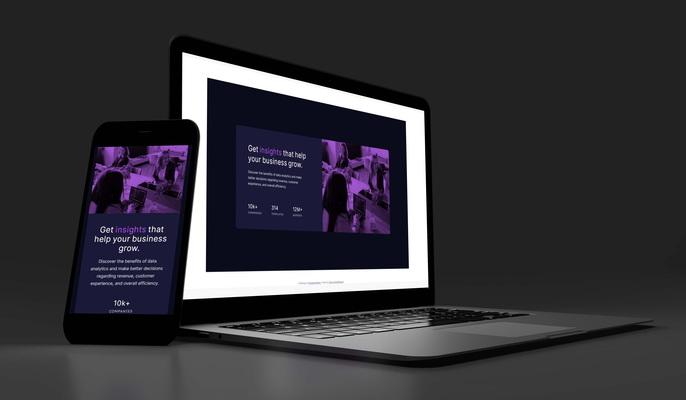

# Frontend Mentor - Stats preview card component solution

This is a solution to the [Stats preview card component challenge on Frontend Mentor](https://www.frontendmentor.io/challenges/stats-preview-card-component-8JqbgoU62). Frontend Mentor challenges help you improve your coding skills by building realistic projects.

## Table of contents

- [Overview](#overview)
    - [The challenge](#the-challenge)
    - [Screenshot](#screenshot)
    - [Links](#links)
- [My process](#my-process)
    - [Built with](#built-with)
    - [What I learned](#what-i-learned)
    - [Continued development](#continued-development)
    - [Useful resources](#useful-resources)
- [Author](#author)


## Overview

### The challenge

Users should be able to:

- View the optimal layout depending on their device's screen size

### Screenshot




### Links

- Solution URL: [https://github.com/gchristofferson/stats-preview-card-component](https://github.com/gchristofferson/stats-preview-card-component)
- Live Site URL: [https://stats-preview-card-component-ten-gilt.vercel.app/](https://stats-preview-card-component-ten-gilt.vercel.app/)

## My process

### Built with

- Semantic HTML5 markup
- CSS custom properties
- Flexbox
- Mobile-first workflow


### What I learned

Although I've used the background-blend-mode property before, in this project I took a little more time to understanding how to use it to blend a background image with a colorful overlay.

Below is the div I applied the background-image and background-blend-mode to:

```html
<div class="card__img"></div>
```
Here are the styles (for mobile layout):
```css
.card__img {
    width: 325px;
    height: 240px;
    border-radius: 10px 10px 0 0;
    background-size: cover;
    background-image: url("../images/image-header-mobile.jpg"),
    linear-gradient(var(--accent), var(--accent));
    background-blend-mode: multiply;
    order: -1;
}
```


### Continued development

I'm sure I could have blended a simple background color with the image using the single background property.  In future projects I will exlplore this further to make sure I'm following best practices when using the background-blend-mode.  I also want to learn more about how to use the related mix-blend-mode to create appealing visual effects.  Mix-blend-modes could have come in handy for a previous project I did where I needed the text color for a button to be the same as the card's background.  I ended up writing 3 different styles for 3 buttons which were each on differently colored backgrounds.  I'm sure I could have used the mix-blend-mode to write one reusable style instead. I'm going to explore this technique more in future projects.

### Useful resources

- [https://highrise.digital/blog/css-blend-modes/](https://highrise.digital/blog/css-blend-modes/) - This is an amazing article which helped me finally understand background-blend-modes and how to use them.   I'd recommend it to anyone still learning this concept. It also explains the mix-blend-mode.

## Author

- Frontend Mentor - [@gchristofferson](https://www.frontendmentor.io/profile/gchristofferson)
- Twitter - [@GreggChristoff2](https://twitter.com/GreggChristoff2)


